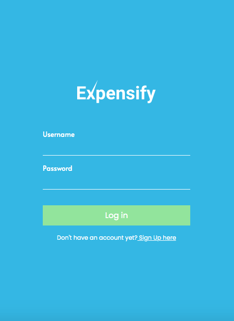
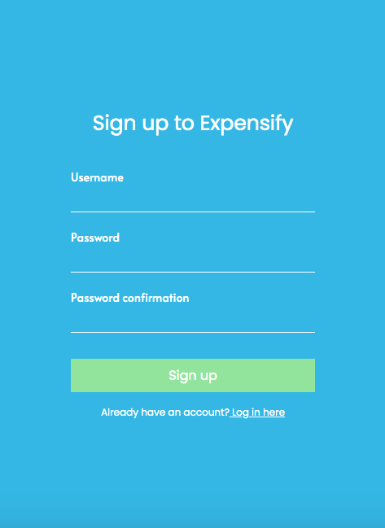
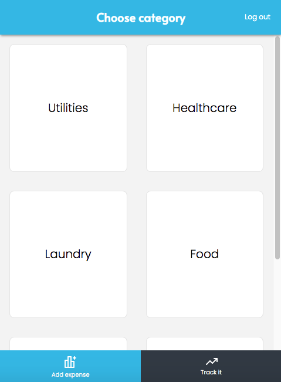
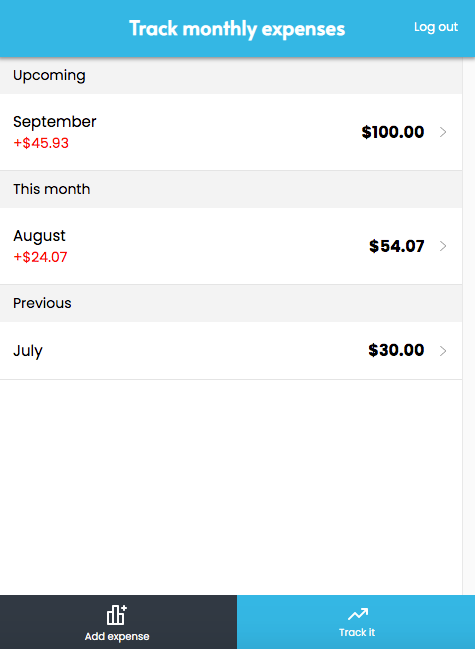

<div style="display:flex; justify-content: center; margin-bottom: 20px; text-align: center">
  
</div>

# Description

> Expensify is a mobile-first web application built using React & Redux that helps users keep track of daily expenses to monitor their monthly cost of living. With expensify, you can add as many expenses as you want for a given date and watch how much you save or overspend per month in the track it page. This application uses React as the frontend framework and Rails for the backend API resources. The frontend code base can be found [here](https://github.com/xtrmdarc/expensify-frontend).

## Live Demo

### Test user 
- username: admin
- password: 123

[Live Demo Version](https://xtrmdarc-expensify-react.herokuapp.com/)






## Built With

- React
- Redux
- React Router
- JS
- HTML
- CSS
- Node.js
- React-DOM
- React-Create-App
- npm
- ES6

## Setup

Install gems with:

```
bundle install
```

Setup database with:

```
   rails db:create
   rails db:migrate
```


### Usage

Start server with:

```
    rails server
```

Open `http://localhost:3000/` in your browser.

### Run tests

```
   rails test
```


## Potential Future Features

- Expense category segrettion on a detail page
- Web responsive design
- Dashboard to add more categories

## Authors

👤 **Diego Antonio Reyes Coronado**

- Github: [@xtrmdarc](https://github.com/xtrmdarc)
- Twitter: [@diegoreyesco](https://twitter.com/DiegoAn91629127)
- Linkedin: [diegoreyesco](https://www.linkedin.com/in/diego-reyes-coronado)

## 🤝 Contributing

Contributions, issues, and feature requests are welcome!

Feel free to check the [issues page](https://github.com/xtrmdarc/expensify/issues).

## Show your support

Give a ⭐️ if you like this project!
